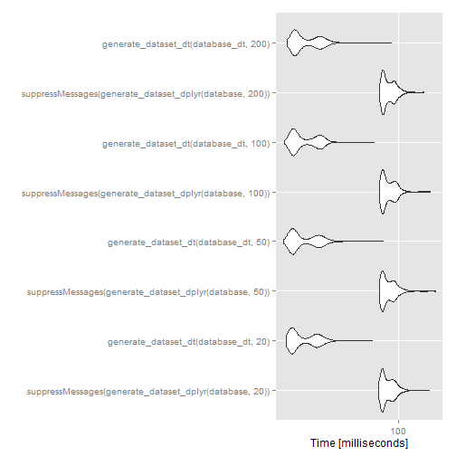

dplyr vs data.table comparions
====================================

Benchmark 1 - subsetting from a large dataframe

```r
suppressMessages(library(dplyr))
suppressMessages(library(data.table))
### create large data source -----------
database <- data.frame(expand.grid(ID = 1:50, TIME = seq(0, 100, 1), REP = 1:250))
database <- database[order(database$REP, database$ID, database$TIME), ]
database <- within(database, {
    CONC <- runif(nrow(database), 1, 10)
    DV <- runif(nrow(database), 1, 10)
    IPRED <- runif(nrow(database), 1, 10)
    PRED <- runif(nrow(database), 1, 10)
    ISM <- ifelse(ID%%2 == 0, 1, 0)
})

head(database)
```

```
##     ID TIME REP ISM  PRED IPRED    DV  CONC
## 1    1    0   1   0 1.262 1.965 9.338 2.856
## 51   1    1   1   0 1.513 9.854 1.099 5.337
## 101  1    2   1   0 2.511 3.420 1.323 3.030
## 151  1    3   1   0 9.914 3.068 6.668 5.791
## 201  1    4   1   0 7.240 1.479 9.828 4.644
## 251  1    5   1   0 4.667 2.331 4.774 8.102
```

```r
### functions
generate_samples <- function(ID, REP, num_inds) {
    id <- sample(x = ID, size = num_inds, replace = TRUE)
    rep <- sample.int(REP, size = num_inds, replace = FALSE)
    data.frame(ID = id, REP = rep)
}

# test key
generate_samples(unique(database$ID), REP = length(unique(database$REP)), num_inds = 10)
```

```
##    ID REP
## 1  17   8
## 2  40  18
## 3   3 141
## 4  17  84
## 5  48 187
## 6  34 183
## 7  38 174
## 8  17  88
## 9  19  26
## 10 31  94
```

```r


generate_dataset_dt <- function(database, inds) {
    num_inds <- inds
    m <- generate_samples(unique(database$ID), REP = length(unique(database$REP)), 
        num_inds = num_inds)
    dt <- data.table(database)
    setkey(dt, ID, REP)
    database_subset <- dt[J(m)]
    return(database_subset)
}

generate_dataset_dplyr <- function(database, inds) {
    num_inds <- inds
    m <- generate_samples(unique(database$ID), REP = length(unique(database$REP)), 
        num_inds = num_inds)
    database_subset <- semi_join(database, m)
    return(database_subset)
}
library(ggplot2)
library(microbenchmark)

# check varying subset sizes 20 - 200 individuals
tm <- microbenchmark(suppressMessages(generate_dataset_dplyr(database, 20)), 
    generate_dataset_dt(database, 20), suppressMessages(generate_dataset_dplyr(database, 
        50)), generate_dataset_dt(database, 50), suppressMessages(generate_dataset_dplyr(database, 
        100)), generate_dataset_dt(database, 100), suppressMessages(generate_dataset_dplyr(database, 
        200)), generate_dataset_dt(database, 200), times = 500L)
tm
```

```
## Unit: milliseconds
##                                                     expr    min     lq
##   suppressMessages(generate_dataset_dplyr(database, 20))  91.87  94.22
##                        generate_dataset_dt(database, 20) 188.59 232.28
##   suppressMessages(generate_dataset_dplyr(database, 50))  91.85  94.28
##                        generate_dataset_dt(database, 50) 189.00 228.62
##  suppressMessages(generate_dataset_dplyr(database, 100))  91.98  94.41
##                       generate_dataset_dt(database, 100) 190.15 223.18
##  suppressMessages(generate_dataset_dplyr(database, 200))  92.05  94.68
##                       generate_dataset_dt(database, 200) 190.00 238.93
##  median    uq   max neval
##   98.81 147.7 162.2   500
##  247.04 276.3 346.7   500
##   99.02 147.4 160.0   500
##  247.67 278.0 357.7   500
##   98.80 147.7 163.6   500
##  246.83 276.5 348.9   500
##   99.49 115.2 161.5   500
##  251.77 280.8 392.6   500
```

```r
autoplot(tm)
```

 


